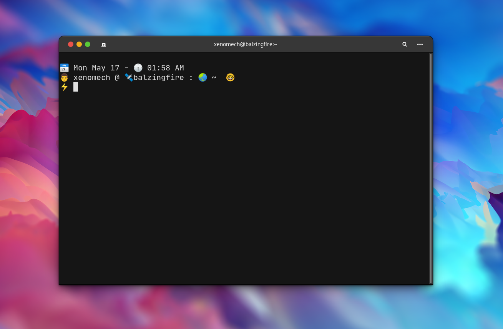

# Rocket 🚀

Just a simple prompt!
This is a simple bash script to style the bash prompt.


## Installation 📃
_This is an alpha build install at your own risk._

As of now there are 2 variants Plain and Emoji

| Options | Decs         |
| ------- | ------------ |
| p       | Plain Prompt |
| e       | Emoji Prompt |

Run

```bash
./install.sh e
```

### The plain prompt 👇


### The emoji prompt 👇




## Features 💫 

- Git branch tracking
- Exit status

and many more on its way 🔥

<p align="center">✌️ Alpha build</p>
